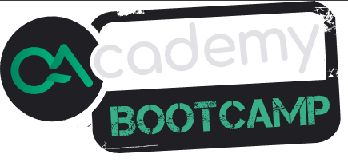

<h1 align="center">Bootcamp Cypress avançado QAcademy</h1>

<p align="center"></p>

--------

## Configurando o Ambiente :gear:

- [Cypress.io](http://www.cypress.io)

- [Documentação Cypress](https://docs.cypress.io/guides/overview/why-cypress.html)

### Requisitos para instalação

- [Node.js](https://nodejs.org/en/)
- [Java 8 ou superrior caso use o Allure Report](https://javadl.oracle.com/webapps/download/AutoDL?BundleId=244036_89d678f2be164786b292527658ca1605)

### Instalação do NPM e instalação do Cypress

Na pasta do projeto abra o terminal ou no VSCode use o Ctrl + ' (aspas simples), e digite os comandos abaixo:

```shell
npm init -y
npm install --yes
npm install cypress@10.4.0 --save-dev
```

### Comandos para iniciar o Cypress :gear:

#### Iniciar o Cypress no navegador:

```shell
   npx cypress open
```

#### Iniciar o serviço backend:

```shell
Executar dev em npm scripts
```

#### Iniciar o serviço frontend:

```shell
   Executar dev em npm scripts
```


#### Para executar em modo headless:

```shell
   npx cypress run
```